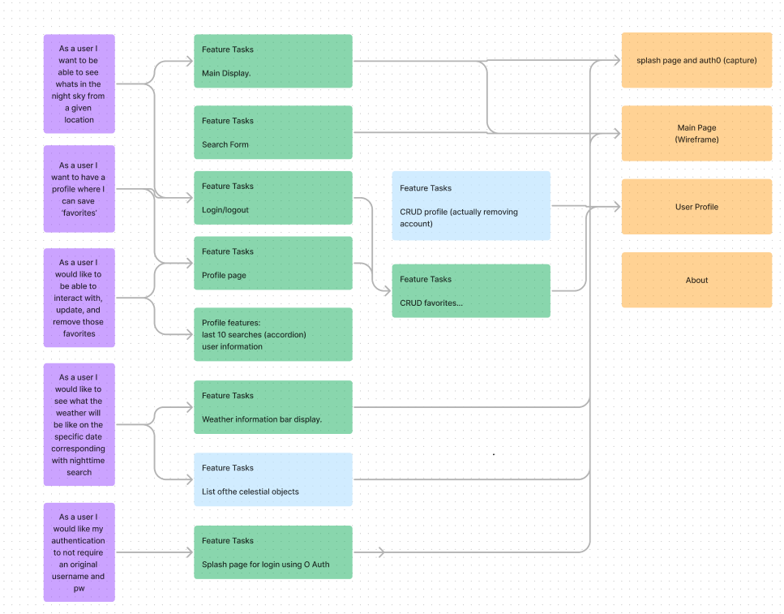
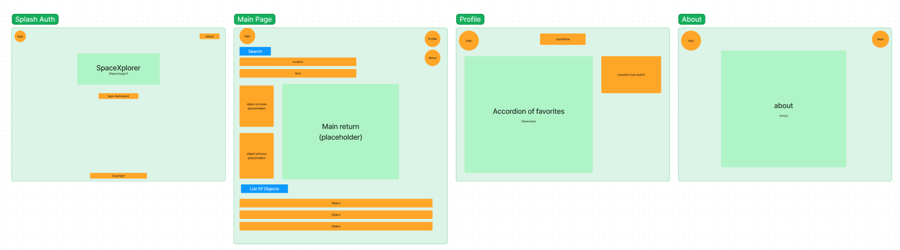
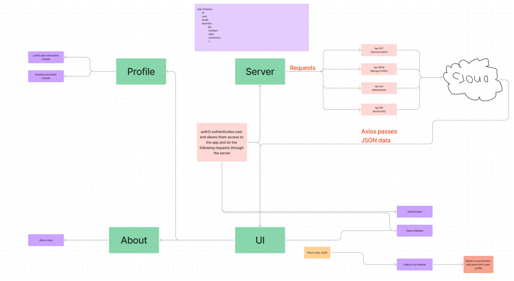

# KerbalRejects README

## Project Planning

### Cooperation Plan

**Key Strengths**

* Gaz: Ability to deconstruct complex problems and a good leader.
* Manuch: Thinking through process(s) algorithmically. 
* Ethan: Creative thinking, ability to look at a project from a different perspective.
* Chris: Think Creativily and Public Speaking good stregth in Backend/server.

**Utilizing these strengths**

* Assigning team members to lead in their individual strengths. Combining our efforts to create a fun, technically challenging, and great project.

**Individual Development**

* Gaz: Get better at CSS/Styling
* Manuch: Functional programming, to get more experience with methods and data structures.
* Ethan: Develop frontend framework experience and creating servers.
* Chris: Better Understanding of front-end work (React), as well get better at logic and proble solving.

**Project Management**

* Keeping people resonsible for their workload and helping where appropriate. Utilizing project management tools such as a Kanban board and software like Trello.

### Conflict Plan
1. What will be your group’s process to resolve conflict, when it arises?

    * Hold each other accountable for their individual workloads. 3-strike rule. Crush conflicts before they start.

2. What will your team do if one person is taking over the project and not letting the other members contribute?

    * Bring up to the individual that they are taking over the project and escalate if necessary.

3. How will you approach each other and the challenges of the project knowing that it is impossible for all members to be at the exact same place in understanding and skill level?

    * Empathy and understanding for each team member. Help each other with team standups and paired programming. Reach out to TAs/Instructors when necessary.

4. How will you raise concerns to members who are not adequately contributing?

    * See answer #2. If a member is not contributing, bring it up to them. And escalate if necessary.

5. How and when will you escalate the conflict if your resolution attempts are unsuccessful?

    * Raise an escalatory issues with Hexx (instructor).

### Communication Plan

**Hours of Availability**

* Gaz: Evenings and afternoons, weekdays and weekends.
* Manuch: Usual class hours. 5:30pm-9:30pm Mon-Thurs and Saturday 9:00am-6:30pm. Flexible.
* Ethan: Usual class hours. 4:30pm-9:30pm Mon-Thurs and Saturday 9:00am-6:30pm. Flexible.
* Chris: : Usual Class Hours. 5:30 - 9:30 Mon- thurs, flexible on Friday (will check schedule). Well do what I can to be available. 

**Platforms**

* Slack, remo, Zoom.

* Whenever we need them.

* Layout MVP objectives and focus heavily on tasks to get the project to that point.

* Letting everybody have opinions, suggestions and comments about what should be changed. And allowing that change to happen.

* Practice inclusivity, make sure everyone feels comfortable, seen and heard. Creating and establishing alignment on project goals and tasks.

### Work Plan

* Utilizing Kanban to track everyones individual and group tasks and ensure that tasks are getting done. If stuff isn't getting done, then re-evaluate and reassign tasks as necessary.

* Trello will be used to track group and individual tasks.

[Slideshow Deck](https://docs.google.com/document/d/1SEJjSn--AqEZrDbxtRhJL_nMpoaS65yRY6RJfgWDBdA/edit?usp=sharing)
[Trello Board](https://trello.com/b/9HvUfNgz)
[GitHub Org/Repos](https://github.com/orgs/KerbalRejects/repositories)
[Figma Whiteboard](https://www.figma.com/file/DbtYtDU61NUaAE2F0OAxvc/Wireframe)

### Git Process

* All components of the codebase and documentation will live on Github.

* We will share the repository through a organization page on GitHub.

**Git Flow**

* Main, dev and feature branches.

feature -> dev -> main

* Two people to review the PR (to main) to ensure that it won't break the entire project.

* Anyone can merge PRs.

* Merge as needed into dev. Merge once for final push into main. Before practice of final presentation.

* We will communicate verbally.

## User Stories

## Page Layout

## Domain Model

